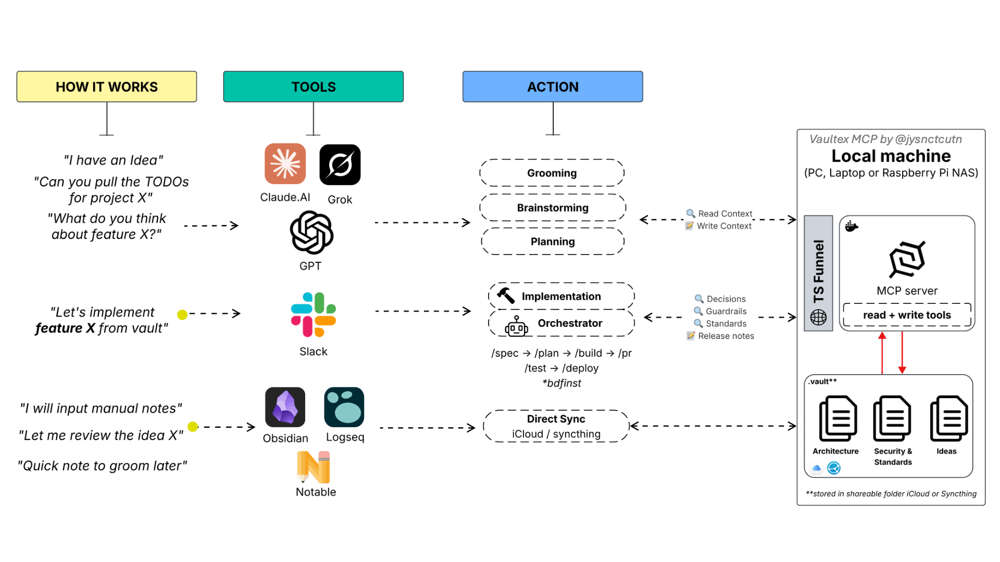

```
██╗   ██╗ █████╗ ██╗   ██╗██╗  ████████╗███████╗██╗  ██╗ 
██║   ██║██╔══██╗██║   ██║██║  ╚══██╔══╝██╔════╝╚██╗██╔╝
██║   ██║███████║██║   ██║██║     ██║   █████╗   ╚███╔╝ 
╚██╗ ██╔╝██╔══██║██║   ██║██║     ██║   ██╔══╝   ██╔██╗ 
 ╚████╔╝ ██║  ██║╚██████╔╝███████╗██║   ███████╗██╔╝ ██╗
  ╚═══╝  ╚═╝  ╚═╝ ╚═════╝ ╚══════╝╚═╝   ╚══════╝╚═╝  ╚═╝ MCP
Stop re-explaining your project every time you switch AI tools.

Local-first context layer for AI agents/tools.
One context. Every AI. No cloud. No subscriptions.
MIT licensed. Free for individuals.
```
[](https://www.bestpractices.dev/projects/14169)&nbsp;
[](https://github.com/jysnctcutn/vaultex/actions/workflows/security.yml)&nbsp;
[](https://modelcontextprotocol.io/)&nbsp;
[](https://github.com/jysnctcutn/vaultex/actions/workflows/ci.yml)&nbsp;
[](https://github.com/jysnctcutn/vaultex/actions/workflows/lint.yml)&nbsp;
[](LICENSE)&nbsp;
[](https://www.python.org/) 
---

**Contents:** [Why it exists](#why-it-exists) ·
[What is Vaultex?](#what-is-vaultex) · [How it works](#how-it-works) ·
[Basic vs Professional](#basic-vs-professional) ·
[Core capabilities](#core-capabilities) ·
[Install](#30-second-installation) · [Connect your AI](#connect-your-ai) ·
[Deployment paths](#deployment-paths) · [Documentation](#full-documentation) ·
[Contributing](#contributing)

## Why it exists

You close a chat in Claude Desktop and open Claude Code tomorrow. ChatGPT
on your phone the week after. None of them share memory with each other, so
every switch starts with the same tax: re-finding the relevant notes,
re-pasting them, re-explaining where the project stands. Your AI shouldn't
forget what the last AI knew.

Measured on one handover of a synthetic three-folder project: **6 files to
open and paste by hand, versus 1 tool call** — and 0 folders you need to
remember, because they resolve from your taxonomy. Reproduce it with
`python3 benchmarks/context_handover_benchmark.py`; method and numbers in
[docs/benchmarks.md](docs/benchmarks.md).

## What is Vaultex?

A persistent, local-first context layer for AI agents, backed by your
Markdown vault. Instead of treating your knowledge base as a raw
filesystem, it exposes *meaningful* context operations — search, read a
note, save a decision, gather everything about a project, and record an
agent's working trail so the next session, in any client, picks up where
the last one left off.

It is deliberately **not a filesystem MCP**. There is no `read_file` /
`write_file` / `list_directory`: every operation goes through a shared
path-safety layer that blocks traversal outside the vault and can hide
entire top-level areas (e.g. client or employer work) from a given server
instance. Don't give an AI raw access to your files — give it a controlled
interface to your knowledge. Your context stays on your machine or your own
tailnet; any MCP-compatible client reaches only the context you choose to
share.



## How it works

```
AI session  →  episodic memory  →  distillation  →  durable project notes
```

An agent opens a session and writes a structured trail as it works — what
it looked at, what it decided, what's still open. That trail is episodic:
cheap to write, allowed to be noisy. Distillation is the second step, where
the high-signal parts are promoted into durable project notes that keep a
link back to the session they came from — so a claim in your vault can
always be traced to the work that produced it, instead of appearing from
nowhere.

Everything is plain Markdown in your own vault, readable in Obsidian, with
no vector-only second store to keep in sync.

## Basic vs Professional

Start at four tools. Grow into the rest only if you want it.

| | **Basic** | **Professional** |
|---|---|---|
| Tools | 4 — `search`, `grep`, `read_note`, `write_note` | 31 — the above plus decisions, brainstorms, episodic memory, distillation, coordination, workspaces |
| Taxonomy | none | `taxonomy.json` |
| Folder layout | yours, untouched | PARA for a fresh vault, or mapped onto folders you already have |
| Writes | explicit path only | routed, named, section-checked, cross-linked |

**Basic** is the "point it at any Markdown folder" path — nothing to
configure, nothing to learn, and a taxonomy-free vault is a supported
configuration rather than an error state. **Professional** is the full
structured surface. `python3 onboard.py` asks which on its first prompt.

Switching, the derivation rule, and workspaces — [docs/modes.md](docs/modes.md).

## Core capabilities

**Context that persists**
- **A context layer, not raw filesystem access** — search, read a note, save
  a decision, gather everything about a project.
- **Folder taxonomy** — map your vault's own folders (or scaffold PARA) once
  via `onboard.py`; custom categories become their own `get`/`create` tools
  automatically at startup. → [docs/taxonomy.md](docs/taxonomy.md)
- **Workspaces** — name your own project contexts ("Personal", "Work",
  "Sandbox") and pass `workspace=` to the project tools. Add one to
  `taxonomy.json` and it works on the next call, no restart.
- **Local semantic search** — optional embeddings index (`index_vault.py`);
  keyword + embeddings merged with Reciprocal Rank Fusion, entirely on your
  machine, no cloud calls.

**What agents can do**
- **Memory lifecycle** — episodic session → structured trail → distillation
  into durable notes, with provenance back to the session that produced
  them. → [docs/tools.md](docs/tools.md)
- **Built for multiple agents** — `claim_note` / `release_note` /
  `flag_conflict` put advisory locks and conflict markers in a note's
  frontmatter so concurrent agents don't clobber each other.
- **Structured writes** — decisions, brainstorms, open questions and
  features land in the right folder, correctly named and cross-linked,
  instead of wherever the agent guessed.

**Control & security**
- **Path-safety by construction** — every tool routes through a shared
  boundary that blocks `..` traversal and can hide entire top-level folders
  (e.g. client/employer work) per server instance.
  → [docs/security-model.md](docs/security-model.md)
- **Read-only mode** — `READ_ONLY=true` removes write tools from the tool
  list entirely, not just blocks them at call time.
- **Tunable write behavior** — a `write_policy.md` note at your vault root
  turns off auto-linking, placement inference, prefix stripping, or silent
  folder creation. Edit and save; the next write picks it up, no restart.
  → [docs/write-policy.md](docs/write-policy.md)
- **Self-hosted OAuth 2.1** — `server.py` is its own single-user
  authorization server; no third-party gateway sits in front of it.
  → [docs/remote-access.md](docs/remote-access.md)
- **No cloud, no subscriptions** — your vault stays on your machine or your
  own tailnet.

## 30-second installation

```bash
git clone https://github.com/jysnctcutn/vaultex.git
python3 install.py   # macOS/Linux 
python install.py # Windows
```

It points at your vault (or creates one), installs dependencies, sets up
your folder taxonomy, builds the semantic-search index, prints your access
token, and offers to start the server right away.

Prefer to do it by hand, or want to see exactly what it automates? The
manual four-stage setup, hardware requirements, both deployment paths, and
upgrading/uninstalling are in
[docs/installation.md](docs/installation.md).

## Connect your AI

Any MCP-compatible client works the same way once the server is running:
point it at your `/mcp` URL and either supply `Authorization: Bearer <your
MCP_AUTH_TOKEN>` (local) or complete the OAuth 2.1 handshake (remote).

- **Claude** (web, mobile, desktop): Settings → Connectors → Add custom
  connector → paste your `/mcp` URL.
- **ChatGPT**: Settings → Connectors → Add connector → paste your `/mcp`
  URL; ChatGPT runs through the same OAuth 2.1 flow.
- **Grok**: Settings → Connectors (or Tools) → Add MCP connector → same URL.

Menu names shift as these products update — if a step doesn't match what
you see, look for "Connectors," "Custom connector," or "MCP" in that
client's settings.

> **Important:** Custom connectors on ChatGPT require a paid plan (Plus or
> above) — the free tier doesn't support them.

## Deployment paths

There are two ways in:

```
                        VAULTEX
                  (Your Markdown vault)
                            │
                       MCP server
                   (server.py + core/)
                            │
             ┌──────────────┴──────────────────────────┐
             │                                         │
  (Path A - 1 Machine)                        (Path B - Cross device)
(local, direct — no tunnel needed)                Tailscale Funnel
             │                             (sidecar, in docker-compose)
             │                                         │                    
Claude Code + Desktop GUI                              │
                                      Grok, Claude, GPT and other AI Clients 
                                            (cli/web/ide/mobile/agents) 
                                             Obsidian/Noteable/Logseq
```

Local access (this machine) talks to `server.py` directly over localhost —
no tunnel, no OAuth, just the bearer token. Remote access (Claude's web or
mobile Connectors) reaches the server through a Tailscale Funnel — bundled as
a sidecar container in `docker-compose.yml`, so nothing needs installing on
the host — and authenticates via OAuth 2.1, which `server.py` implements
itself (`core/oauth/`). No third-party gateway sits in front of it.

## Why Vaultex

- **Your AI shouldn't forget what the last AI knew.** Continuity is the
  product, not a feature of it.
- **One context. Every AI.** The vault is the shared memory; clients come
  and go.
- **Controlled, not raw.** A semantic interface to your knowledge, with the
  path boundary enforced for every tool rather than trusted per call.

## Full documentation

Deeper reference lives in [`docs/`](docs/):

- **[Installation](docs/installation.md)** — the manual four-stage setup,
  hardware requirements, Path A vs Path B, upgrading and uninstalling
- **[Modes](docs/modes.md)** — Basic vs Professional, how the mode is chosen
  and switched, workspaces, and the deprecated `professional` flag
- **[Write policy](docs/write-policy.md)** — the four `write_policy.md`
  toggles, what stays non-configurable, and every failure mode a tool can
  return
- **[Configuration reference](docs/configuration.md)** — every `.env`
  variable, what "Running" serves, and the optional semantic-search index
- **[Available tools](docs/tools.md)** — the full 31-tool table and the
  episodic-memory / distillation / multi-agent coordination lifecycle
- **[Folder taxonomy](docs/taxonomy.md)** — `onboard.py`, the 9 built-in
  roles, workspaces, custom categories, per-project subfolders
- **[Architecture](docs/architecture.md)** — how the repo is laid out
  (`server.py`, `core/`, `tools/`)
- **[Security model](docs/security-model.md)** — path safety, auth, the
  OWASP Top 10 (2025) self-review, CI and pre-commit gates
- **[Remote access](docs/remote-access.md)** — the self-hosted OAuth 2.1
  server, the Tailscale sidecar, and Path B troubleshooting
- **[Benchmarks](docs/benchmarks.md)** — the manual-context-handover
  measurement and how to reproduce it
- **[Memory curator](docs/memory-curator.md)** — the curator role that turns
  a distilled session into durable notes

## Contributing

Bug reports, feature ideas, and PRs are welcome — see [CONTRIBUTING.md](CONTRIBUTING.md)
for the dev setup, test policy, and PR checklist. Security issues go through
[SECURITY.md](SECURITY.md) instead of a public issue. Participation is
governed by the [Code of Conduct](CODE_OF_CONDUCT.md). See
[GOVERNANCE.md](GOVERNANCE.md) for how decisions get made, and
[ROADMAP.md](ROADMAP.md) for what's planned (and explicitly not planned)
over the next year.

## License

[MIT](LICENSE) — do what you want with it.
